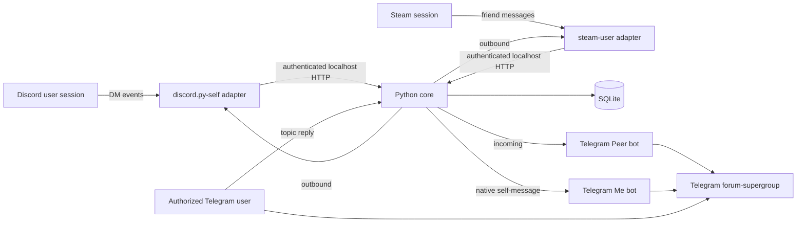

<div align="center">

# Unified Inbox

**Discord and Steam direct messages, routed into persistent Telegram Forum Topics.**

[](https://github.com/kyoukisu/unified-inbox/actions/workflows/ci.yml)
[](LICENSE)
[](https://www.python.org/)
[](https://nodejs.org/)
[](https://docs.docker.com/compose/)

</div>

> [!WARNING]
> The Discord adapter is a **self-bot**. Discord prohibits automating normal user accounts and may suspend or terminate the account. Use it only if you accept that risk.

Unified Inbox turns one Telegram forum-supergroup into a durable UI for Discord and Steam DMs. Every external conversation receives a persistent topic. Incoming messages are posted by one Telegram bot, while messages sent from native desktop clients are mirrored by a second bot, making direction immediately visible.

| Telegram identity | Meaning |
| --- | --- |
| **Peer** | A message received from the Discord or Steam contact |
| **Me** | A self-message sent from another Discord or Steam client |
| **Your Telegram account** | A reply that the bridge sends back to the external conversation |

Telegram cannot start a new external DM. A topic is created only after real native activity, which keeps the bridge constrained to conversations that already exist on Discord or Steam.

## Features

- Persistent Telegram Forum Topic per Discord DM, Discord group DM, or Steam friend conversation.
- Bidirectional text and image delivery.
- Reply mapping when the referenced external message is known.
- Native outgoing-message mirroring from Discord and Steam desktop clients.
- Separate Inbox and Outbox Telegram identities for visual direction.
- SQLite-backed durable delivery queue with crash leases, ordered retries, message-copy mappings, deduplication, and polling state.
- Numeric Telegram chat and user ACLs.
- Bounded HTTPS media downloads with platform-specific hostname allowlists.
- Persistent Steam refresh-token rotation.
- Persistent Discord and Steam ingress spools plus outbound checkpoints that reduce duplicate retries across restarts.
- Telegram delivery reactions: `👀` queued, `👍` delivered, and `👎` terminal failure.
- Retry-aware handling for Telegram flood control and missing reply targets.
- Hardened containers: non-root UID, read-only root filesystems, dropped capabilities, and `no-new-privileges`.
- NixOS module and Ubuntu systemd unit.

## Architecture



The core is the only SQLite owner. Adapters communicate with it through bearer-authenticated HTTP bound to `127.0.0.1`. No container publishes a network port.

## Requirements

- Linux. NixOS and Ubuntu are documented; other modern distributions should work.
- Docker Engine 24+ with Docker Compose v2.
- Python 3 for the secret initialization helper.
- A private Telegram supergroup with Topics enabled.
- Two dedicated Telegram bots.
- A Discord user token.
- A Steam account and one-time authentication approval.

The host user that owns `secrets/` may use any numeric UID. Set `APP_UID` in `.env` before the first image build. The default is `1000`, which matches the first desktop user on most Ubuntu installations.

## Quick start

### 1. Clone and initialize

```bash
git clone https://github.com/kyoukisu/unified-inbox.git
cd unified-inbox
./scripts/init-secrets.sh
cp .env.example .env
```

Set `APP_UID` to the owner of the checkout:

```bash
id -u
```

Edit `.env`:

```dotenv
APP_UID=1000
TELEGRAM_CHAT_ID=-1000000000000
TELEGRAM_ALLOWED_USER_ID=123456789
TELEGRAM_POLL_TIMEOUT=30
MAX_IMAGE_BYTES=20971520
DELIVERY_MAX_ATTEMPTS=10
DELIVERY_LEASE_SECONDS=300
DELIVERY_RETRY_MAX_SECONDS=300
STEAM_AUTH_MODE=qr
```

`TELEGRAM_CHAT_ID` must be the numeric ID of the forum-supergroup. `TELEGRAM_ALLOWED_USER_ID` is the only Telegram account allowed to send external messages or commands.

### 2. Configure Telegram

1. Create two bots through BotFather.
2. Add both bots to the private forum-supergroup.
3. Give the Peer bot permission to manage topics and post messages.
4. Give the Me bot permission to post messages.
5. Optionally rename them to visually distinct identities such as `Peer` and `Me` and assign distinct avatars.
6. Enable BotFather privacy mode.
7. After both bots are in the intended group, disable adding them to new groups.

Write their tokens without placing them in shell history:

```bash
umask 077
read -rsp 'Peer bot token: ' token
printf '%s' "$token" > secrets/telegram_bot_token
unset token
printf '\n'

read -rsp 'Me bot token: ' token
printf '%s' "$token" > secrets/telegram_outbox_bot_token
unset token
printf '\n'
```

### 3. Configure Discord

Write the user token to `secrets/discord_user_token` using the same hidden-input pattern. Never paste it into `.env`, Compose YAML, an issue, or a command-line argument.

```bash
umask 077
read -rsp 'Discord user token: ' token
printf '%s' "$token" > secrets/discord_user_token
unset token
printf '\n'
```

### 4. Authenticate Steam

QR authentication is the default:

```bash
docker compose --profile tools run --rm steam-auth
```

For credentials authentication, set `STEAM_AUTH_MODE=credentials`, then populate `secrets/steam_account_name` and `secrets/steam_password`. Empty the password file immediately after the refresh token has been saved:

```bash
: > secrets/steam_password
chmod 600 secrets/steam_password
```

Runtime uses the refresh token in the `steam-data` Docker volume; it does not need the account password.

### 5. Validate and start

```bash
docker compose config --quiet
docker compose up -d --build
docker compose ps
```

All three long-running services should become healthy:

- `core`
- `discord-adapter`
- `steam-adapter`

## Ubuntu autostart

Install Docker Engine and the Compose plugin using Docker's official Ubuntu instructions. Place the checkout at `/opt/unified-inbox` so the supplied unit works unchanged:

```bash
sudo install -d -o "$USER" -g "$USER" /opt/unified-inbox
git clone https://github.com/kyoukisu/unified-inbox.git /opt/unified-inbox
cd /opt/unified-inbox
./scripts/init-secrets.sh
cp .env.example .env
```

Complete the configuration and one-time Steam authentication, then install the unit:

```bash
sudo install -m 0644 docs/unified-inbox.service /etc/systemd/system/unified-inbox.service
sudo systemctl daemon-reload
sudo systemctl enable --now unified-inbox.service
systemctl status unified-inbox.service
```

Update safely:

```bash
git -C /opt/unified-inbox pull --ff-only
sudo systemctl reload unified-inbox.service
```

If the checkout lives elsewhere, update every `/opt/unified-inbox` path in the example unit before installing it.

## NixOS

The repository exports `nixosModules.default` and `nixosModules.unified-inbox`.

Add it as a flake input:

```nix
{
  inputs.unified-inbox.url = "github:kyoukisu/unified-inbox";

  outputs = { self, nixpkgs, unified-inbox, ... }: {
    nixosConfigurations.host = nixpkgs.lib.nixosSystem {
      system = "x86_64-linux";
      modules = [
        unified-inbox.nixosModules.default
        {
          services.unified-inbox = {
            enable = true;
            projectDirectory = "/opt/unified-inbox";
          };
        }
      ];
    };
  };
}
```

The module declaratively enables Docker, installs `unified-inbox.service`, defines startup ordering, validates required secrets, and owns the Compose lifecycle. The checkout, `.env`, SQLite, Docker volumes, and `0600` credentials intentionally remain outside the world-readable Nix store.

Apply with your normal host flake:

```bash
sudo nixos-rebuild switch --flake /path/to/your/flake#host
```

## Operation

```bash
# Status
systemctl status unified-inbox.service
docker compose ps

# Logs
docker compose logs -f --tail=100

# Rebuild after a source update
sudo systemctl reload unified-inbox.service

# Stop without deleting persistent state
sudo systemctl stop unified-inbox.service
```

Do **not** run `docker compose down -v` unless you intend to delete conversation mappings and the Steam refresh token.

### Topic commands

Run commands inside a mapped conversation topic:

- `/status` — adapter connection and delivery-queue status.
- `/failures` — list terminal delivery failures for this topic.
- `/retry` — retry the oldest failed job in this topic.
- `/retry <job-id>` — retry one failed job.
- `/retry all` — retry all failed jobs in topic order.
- `/rename <name>` — rename the Telegram topic.
- `/close` — close the topic without deleting its persisted mapping.

## Persistence and backup

Persistent state lives in two named volumes:

| Volume | Contents |
| --- | --- |
| `unified-inbox_core-data` | SQLite conversations, durable delivery jobs, message copies, deduplication, and Telegram offset |
| `unified-inbox_discord-data` | Discord ingress spool and outbound idempotency state |
| `unified-inbox_steam-data` | Steam refresh token, ingress spool, and outbound delivery checkpoints |

`docker compose down`, system shutdown, service restart, and host reboot preserve both volumes. Back them up before destructive Docker maintenance. Never publish a backup: it contains private routing metadata and authentication material.

## Security model

- Secrets are ignored by Git, stored in local `0600` files, and mounted read-only.
- Containers run as `APP_UID`; use the UID that owns the secret files.
- Root filesystems are read-only and all Linux capabilities are dropped.
- Core and adapter servers bind only to loopback.
- Internal HTTP calls require a randomly generated bearer token.
- Telegram input requires both the configured numeric group ID and user ID.
- The Me bot never polls Telegram and cannot react to users.
- Telegram cannot initiate a conversation that has no native Discord or Steam activity.
- Media URLs require HTTPS, pass a strict host allowlist, and remain below `MAX_IMAGE_BYTES`.
- Runtime state and credentials never enter Git or the Nix store.

See [SECURITY.md](SECURITY.md) for reporting guidance and credential-rotation procedures.

## Development

Install [uv](https://docs.astral.sh/uv/), Node.js 24, npm, and [just](https://github.com/casey/just):

```bash
just lock
just lint
just unit
just build
```

The current test suite covers SQLite migrations and leases, crash recovery, per-conversation ordering, retry scheduling, delivery-part checkpoints, ACLs, routing, reply mappings, media validation, adapter spools, native Outbox behavior, and Steam message parsing.

## Limitations

- Discord self-bots violate Discord's Terms of Service.
- Only direct messages and Discord group DMs are routed; guild channels are ignored.
- Native messages sent while an adapter process is not running are not yet replayed from platform history. Events observed by a running adapter are durably spooled.
- Telegram retains unconsumed Bot API updates for at most 24 hours; a longer complete outage cannot be recovered through the Bot API.
- Delivery is at-least-once. Persistent idempotency and part checkpoints prevent ordinary duplicates, but an ambiguous network failure after remote acceptance can still produce a visible duplicate rather than silent loss.
- Telegram forum-supergroup members can read bridged content. Use a private group with intentionally limited membership.
- The bridge does not provide end-to-end encryption beyond the underlying platforms.

## License

[MIT](LICENSE)
